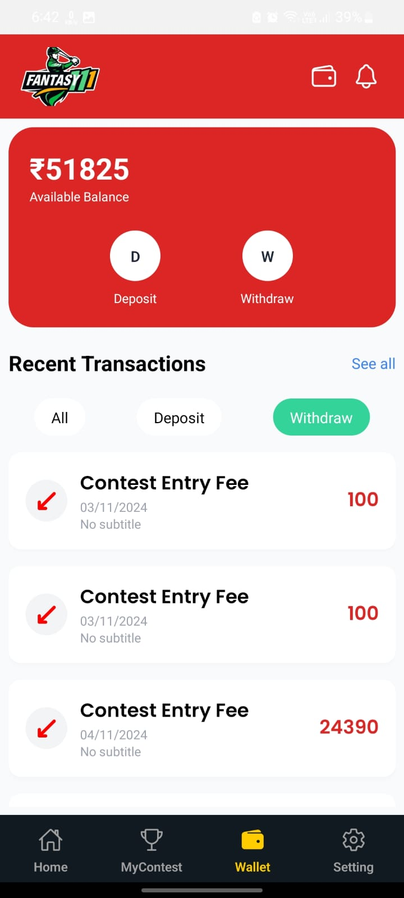
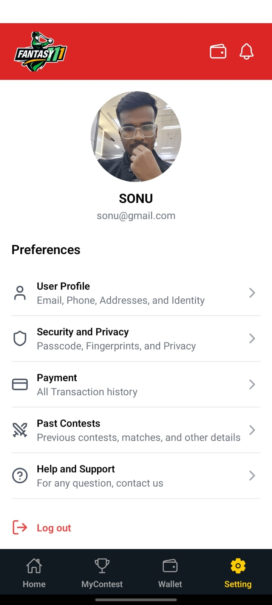
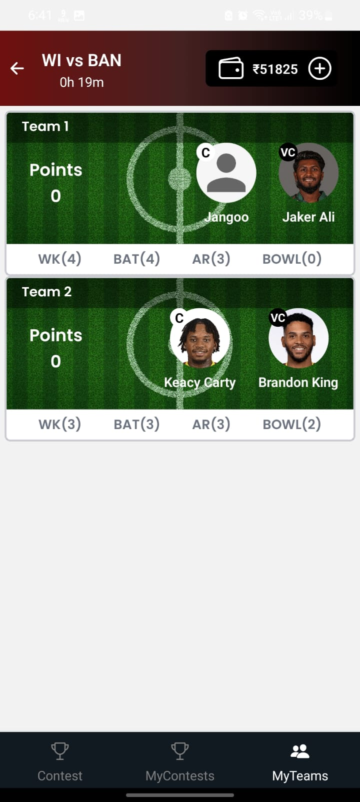

# Cricket Fantasy App

## Overview
The Cricket Fantasy App allows users to create fantasy teams, participate in contests, and track real-time cricket matches. Designed for high scalability, the app supports over 100,000 concurrent users with real-time updates fetched every second. It is built with modern technologies to ensure seamless performance and reliability.

## Features
- **Real-Time Match Data**: Live updates using third-party APIs.
- **Team Management**: Users can create and manage temporary teams based on match IDs.
- **Dynamic Stats**: Calculate player selection statistics such as `selectedBy` dynamically.
- **Admin Dashboard**: A React-based admin panel to manage matches and contests.

## Tech Stack
- **Application**: React Native
- **Admin Panel**: React.js
- **Backend**: Node.js
- **Database**: MongoDB

## Screenshots

### 1. Login


### 2. Home Screen


### 3. Contests


### 4. Wallet



### 5. Setting



### 6. MyTeam



### 7. Admin Dashboard


### 8. Contest Creation


## Installation

### Prerequisites
- Node.js (v16 or later)
- MongoDB (running instance or cluster)
- npm or yarn package manager

### Clone the Repository
```bash
git clone https://github.com/yourusername/cricket-fantasy-app.git
cd cricket-fantasy-app
```

### Backend Setup
1. Navigate to the backend directory:
   ```bash
   cd backend
   ```
2. Install dependencies:
   ```bash
   npm install
   ```
3. Configure environment variables:
   Create a `.env` file in the backend directory with the following:
   ```env
   PORT=your port
   MONGO_URI=your_mongodb_connection_string
   API_KEY=your_third_party_api_key
   JWT_SECRET=your_jwt_secret
   ```
4. Start the backend server:
   ```bash
   npm start
   ```

### Frontend Setup
1. Navigate to the frontend directory:
   ```bash
   cd adminDashboard
   ```
2. Install dependencies:
   ```bash
   npm install
   ```
3. Start the development server:
   ```bash
   npm run dev
   ```

### Mobile App Setup
1. Install dependencies in the React Native app directory:
   ```bash
   cd androidApk
   npm install
   ```
2. Run the app:
   - For Android:
     ```bash
     npm run start
     ```

## Usage
- Launch the backend and frontend servers.
- Open the mobile app to create teams, join contests, and track match stats.
- Use the admin dashboard to manage contests and matches.

## Contributing
1. Fork the repository.
2. Create a new branch:
   ```bash
   git checkout -b feature-name
   ```
3. Make your changes and commit them:
   ```bash
   git commit -m "Added a new feature"
   ```
4. Push to your fork:
   ```bash
   git push origin feature-name
   ```
5. Open a pull request.

## License
This project is licensed under the [MIT License](./LICENSE).

---

Feel free to reach out with any questions or suggestions!
