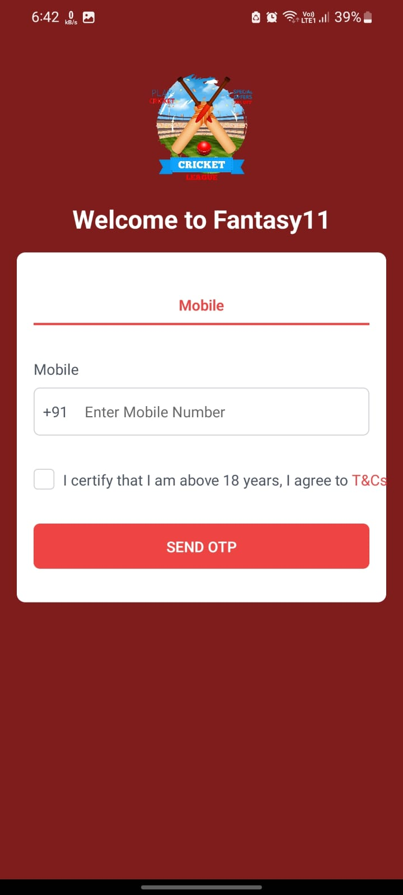
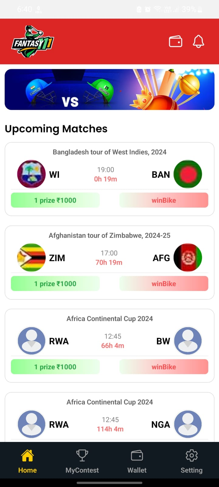
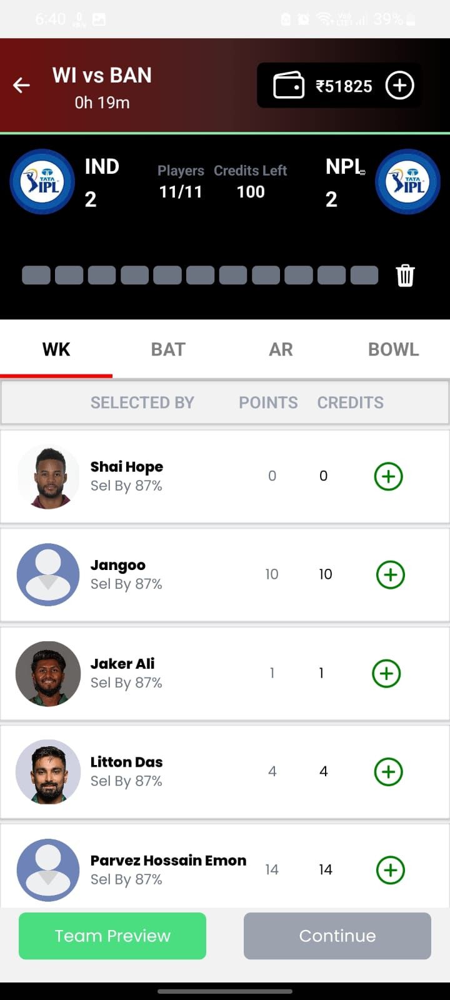
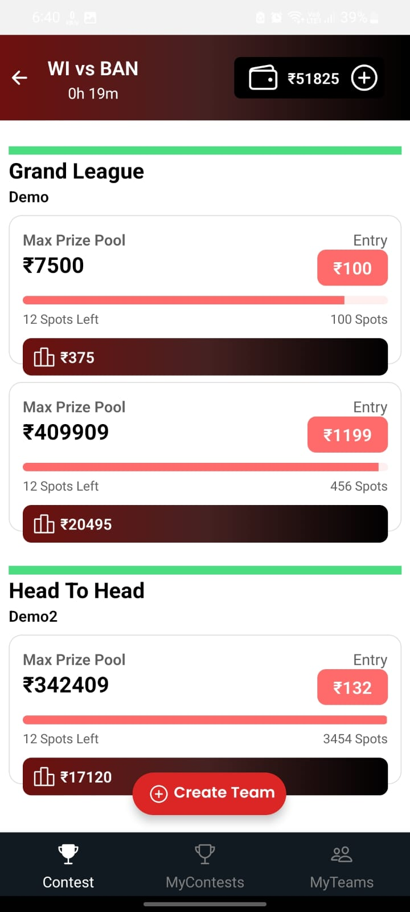
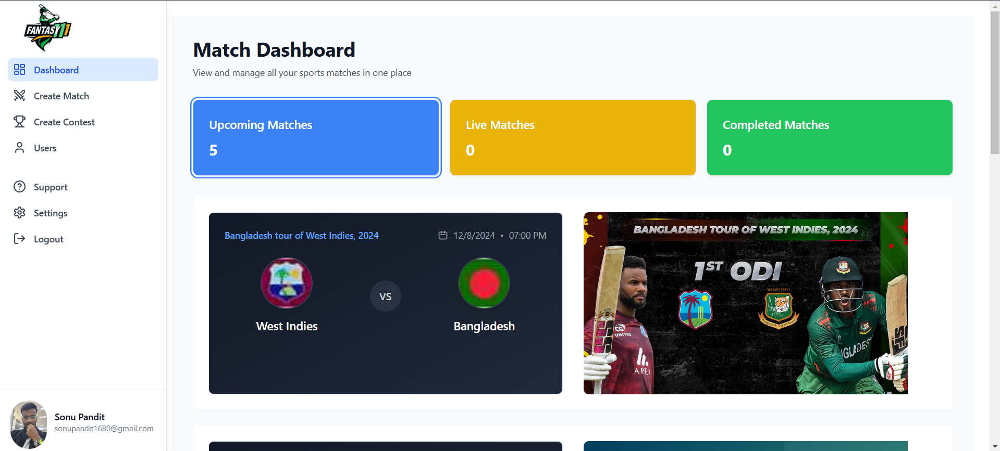
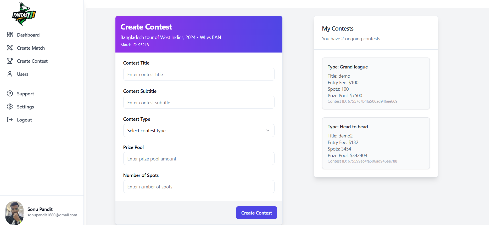

# 🏏 Cricket Fantasy App

## 📝 Overview

Cricket Fantasy App is a cutting-edge mobile application that allows cricket enthusiasts to create fantasy teams, participate in contests, and track real-time cricket matches. Designed for high scalability, the app supports over 100,000 concurrent users with instantaneous updates.

## ✨ Features

- **Real-Time Match Data**: Live updates fetched from third-party APIs
- **Team Management**: Create and manage dynamic fantasy teams
- **Dynamic Player Statistics**: Real-time player selection insights
- **Comprehensive Admin Dashboard**: Full contest and match management
- **Secure Authentication**: JWT-based user authentication
- **Wallet System**: Integrated financial transactions

## 🖥️ Tech Stack

- **Mobile App**: React Native
- **Admin Panel**: React.js
- **Backend**: Node.js
- **Database**: MongoDB
- **Authentication**: JSON Web Tokens (JWT)

## 🚀 Quick Start

### Prerequisites

- Node.js (v16+)
- MongoDB
- npm or yarn
- React Native development environment

### Installation

1. Clone the repository
```bash
git clone https://github.com/yourusername/cricket-fantasy-app.git
cd cricket-fantasy-app
```

2. Setup Backend
```bash
cd backend
npm install
# Create .env file with necessary configurations
npm start
```

3. Setup Admin Dashboard
```bash
cd adminDashboard
npm install
npm run dev
```

4. Setup Mobile App
```bash
cd androidApk
npm install
npm run start
```

## 🔐 Environment Variables

Create a `.env` file in the backend directory with:
```env
PORT=5000
MONGO_URI=your_mongodb_connection_string
API_KEY=your_third_party_api_key
JWT_SECRET=your_secure_jwt_secret
```

## 📱 Screenshots

### Mobile App
<p float="left">
  
  
  
  
</p>

### Admin Dashboard
<p float="left">
  
  
</p>

## 🤝 Contributing

1. Fork the repository
2. Create your feature branch (`git checkout -b feature/AmazingFeature`)
3. Commit your changes (`git commit -m 'Add some AmazingFeature'`)
4. Push to the branch (`git push origin feature/AmazingFeature`)
5. Open a Pull Request

## 📋 Todo

- [ ] Implement advanced player analytics
- [ ] Add more payment gateways
- [ ] Develop iOS version
- [ ] Create comprehensive test suite

## 🔒 Security

- JWT-based authentication
- Bcrypt password hashing
- Input validation and sanitization
- Rate limiting implemented

## 📊 Performance

- Supports 100,000+ concurrent users
- Real-time updates every second
- Optimized MongoDB queries
- Efficient caching mechanisms

## 📜 License

Distributed under the MIT License. See `LICENSE` for more information.

## 📞 Contact

Sonu Kumar Pandit - sonupandit1680@gmail.com

Project Link: [https://github.com/yourusername/cricket-fantasy-app](https://github.com/sonu1680/cricket-fantasy-app)

---

**⭐ Don't forget to star this repository if you find it helpful!**
